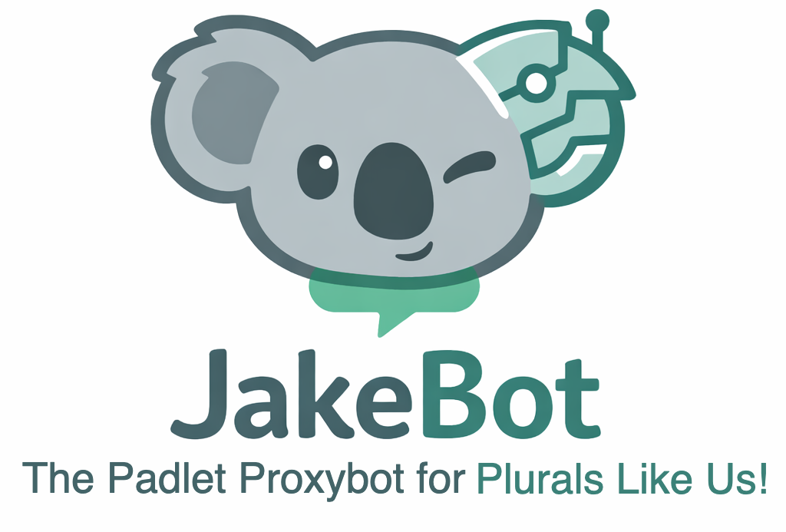

### JakeBot

**A Padlet Proxybot for Plurals Like Us!**

> Status: This project is in live development. What you see here reflects active work and evolving snapshots. Development happens in GitHub Codespaces, and updates roll in as commits are pushed.

**What is this?**

I’m plural. That means my mind isn’t just me, it includes others with their own thoughts, feelings, and voices.

One of those voices is Jake. He’s a koala 🐨 who lives in my Mindforest. Jake has his own opinions, personality, and a strong urge to express himself wherever we happen to be online. Honestly? I like that about him.

Like most people, Jake wants independence; especially digitally. He prefers speaking through his own profile rather than being filtered through mine. That's quite understandable.

**The problem**

I don’t have two devices.

If Jake wants to post as himself, I’d have to sign out of my account, log into his, post, then switch back again. If I want to speak, we reverse the process. That gets frustrating fast.

On Discord, this problem is already solved. Bots like Tupperware let Jake speak through my account while clearly showing him as the author. Clean. Simple. Effective.

Padlet, however, has no such solution. Possibly because plurals rarely use it. We do.

**The idea**

Jake’s fourth-month birthday rolled around, and I didn’t have a gift for him. Around 5 PM, it clicked: I could build one.

JakeBot became that gift.

The challenge was making it work without Padlet’s paid API. Why the API costs money is a mystery for another day, but it meant I had to get creative.

**The solution**

After a lot of research and experimentation, I landed on a headless browser approach.

**The bot:**

* Logs into Jake’s Padlet account
* Watches for input
* Posts messages under his name
* Runs continuously in the background

After wrestling with Padlet’s quirks, detours, and curveballs, *I got it working!*

Now I start the bot, have Jake input his credentials, and let it run. When Jake speaks through me, his words appear under his own profile.

**Mission accomplished.**

**What still needs work**

JakeBot is functional, but far from finished. Things that need improvement:

* A proper command system
* Speed and reliability optimizations
* Easier setup and configuration

If you’re interested in helping, you’re very welcome.

**How to run it yourself**

1. Fork the repository
2. Open it in GitHub Codespaces
3. Run run.sh to prepare the environment
4. Edit jakebot/watch.js (Padlet URLs, brackets, etc.)
5. From the jakebot folder, run `node watch.js`
6. Have your Mind Buddy enter their credentials
7. Let the bot do its thing

---

# 🐨
### Final note: This is an ongoing experiment. I actively develop in Codespaces, and each push represents a snapshot anyone can use or build on.
